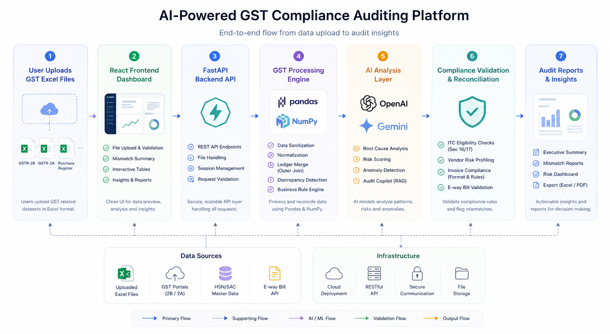

# GST Compliance Agent

<p align="center">
  
</p>

AI-powered GST compliance auditing platform for automated invoice validation, anomaly detection, reconciliation, and compliance reporting.

---

## Overview

GST Compliance Agent is an end-to-end auditing platform designed to simplify GST compliance workflows. The system processes GST datasets, validates records, identifies discrepancies, detects anomalies, and generates actionable audit insights through an intuitive dashboard.

The platform combines modern web technologies, data processing frameworks, and AI-powered analysis to streamline compliance auditing and reporting.

---

## Key Features

- Automated GST invoice validation
- AI-powered anomaly detection
- Purchase register and GST reconciliation
- Compliance rule verification
- Risk assessment and scoring
- Audit report generation
- Interactive dashboard for data analysis
- Excel dataset processing and validation

---

## System Architecture

```text
React Frontend
      │
      ▼
FastAPI Backend
      │
      ▼
Data Processing Engine
(Pandas + NumPy)
      │
      ▼
AI Analysis Layer
(OpenAI / Gemini)
      │
      ▼
Compliance Validation
      │
      ▼
Audit Reports & Insights
```

---

## Tech Stack

### Frontend
- React
- JavaScript
- CSS

### Backend
- Python
- FastAPI

### Data Processing
- Pandas
- NumPy

### AI Integration
- OpenAI API
- Gemini API

---

## Workflow

1. Upload GST datasets
2. Validate and sanitize records
3. Process and reconcile financial data
4. Detect mismatches and anomalies
5. Perform compliance verification
6. Generate audit insights and reports

---

## Project Structure

```bash
gst-compliance-agent/
│
├── backend/
├── frontend/
├── test_data/
├── requirements.txt
├── run.py
└── README.md
```

---

## Installation

```bash
git clone https://github.com/pratheek-R1/Gst-Compliance-Auditor.git

cd Gst-Compliance-Auditor

pip install -r requirements.txt
```

---

## Running the Application

```bash
python run.py
```

---

## Demo

[Watch Demo](YOUR_DEMO_LINK)

---

## Use Cases

- GST compliance auditing
- Vendor invoice verification
- Purchase register reconciliation
- Tax discrepancy identification
- Internal audit workflows
- Compliance reporting and documentation

---
